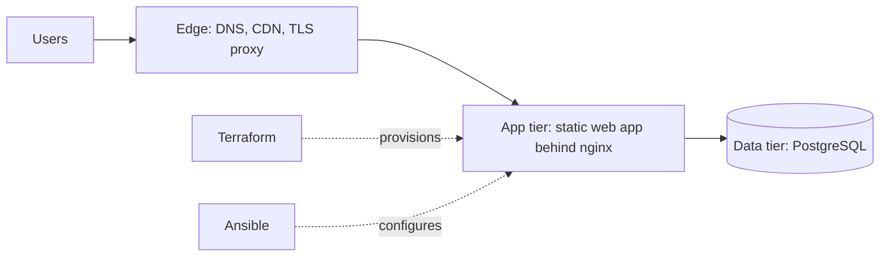

# Project Shell Space


---

## The Story

Teams that do their most valuable work (proprietary designs, unreleased ideas, creative innovation) are forced into a bad trade: convenient tools that expose their work, or private tools nobody enjoys using.

Shell Space exists to end that trade-off. It is a place where a team can think out loud, build together and share freely, knowing the walls around the room are as strong as the ideas inside it.

---

## Overview

**Project Shell Space** is a secure, privacy-focused collaboration platform built to protect high-value intellectual property, proprietary technical designs, and creative innovations.

By integrating end-to-end encryption, automated infrastructure delivery, and advanced threat telemetry, Shell Space provides teams with an isolated, resilient environment for real-time and asynchronous communication.

---

## What's Inside

| Space | Purpose |
|---|---|
| 💬 **Channels & Threads** | Real-time and asynchronous conversation, with reactions |
| 🗂️ **Kanban Boards** | Plan and track work alongside the conversation |
| 🎥 **Video Rooms** | Face-to-face collaboration without leaving the workspace |
| 🎨 **Whiteboard** | Sketch and design together, live |

---

## Key Security Features

- **Zero-Trust Access Control** — Strict identity verification and role-based policy enforcement across all communication channels.
- **End-to-End Encryption** — All endpoints communicate through encrypted tunnels, with mandatory encryption at rest and in transit.
- **Dynamic Infrastructure as Code** — Provisioned fully through version-controlled Terraform with zero hardcoded credentials or static IP bindings.
- **Telemetry & Threat Detection** — Built for continuous auditability and integration with anomaly-based detection mechanisms.

---

## Design Principles

- **Secure by default** — Least privilege, closed ports, key-only and multi-factor access, no secrets in the repository.
- **Human in the loop** — Every infrastructure and code change is reviewed and approved before it is applied.
- **Lean by design** — Sized to run on a free-tier footprint for small teams, with a clear path to scale.
- **Reproducible** — Infrastructure is provisioned with Terraform and configured with Ansible, so any environment can be rebuilt from the repository.

---

## Architecture at a Glance



Traffic reaches the platform through an edge layer that terminates and filters requests. Terraform provisions the infrastructure and Ansible configures and hardens it. Detailed diagrams live in [`docs/topology`](./docs/topology).

---

## Tech Stack

| Layer | Technology |
|---|---|
| Frontend | React, Vite, Tailwind CSS, shadcn/ui |
| Backend services | Self-managed services |
| Infrastructure as Code | Terraform (Google Cloud) |
| Configuration management | Ansible |
| Edge | Cloudflare |
| Data | PostgreSQL |

---

## Roadmap & Status

- [x] Security baseline and repository hardening
- [x] Application file structure defined
- [x] Terraform foundation (Google Cloud free tier)
- [x] Ansible roles: base, security, web, data
- [ ] Cloud account activation and first deployment
- [ ] Application implementation, file by file
- [ ] Hardening, monitoring and launch

> 🔒 *This project is actively under construction. Architecture and infrastructure details will be documented as layers are completed and approved.*

---

## Repository Layout

```text
.
├── main.tf, variables.tf, providers.tf, outputs.tf   # Terraform
├── ansible/        # Inventories, roles, playbooks, vault template
├── src/            # React application
├── docs/topology/  # Architecture diagrams
└── content/        # Project documents and prompts
```

---

## Getting Started

The infrastructure is not yet deployed. Once the cloud account is active:

1. Copy `terraform.tfvars` placeholders and set your project values (never commit secrets).
2. Run `terraform plan` and review before any `apply`.
3. Configure the host with `ansible-playbook ansible/playbooks/site.yml`.

---

## Contributing

The project is currently maintained by a single owner who approves every change. Pull request reviews will be required on `main` once additional developers join.
